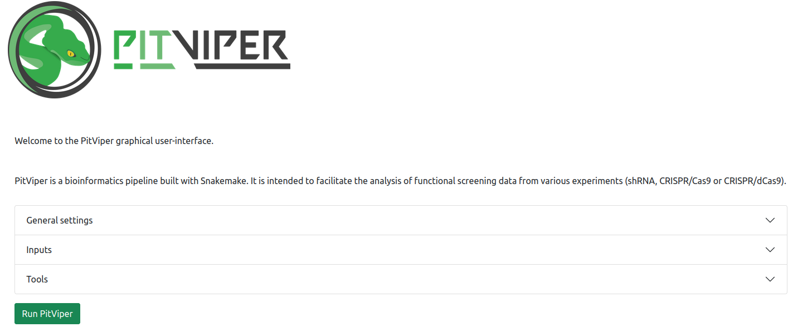
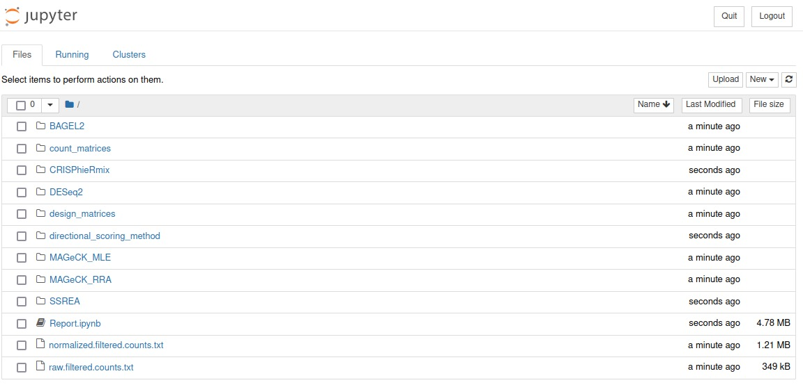
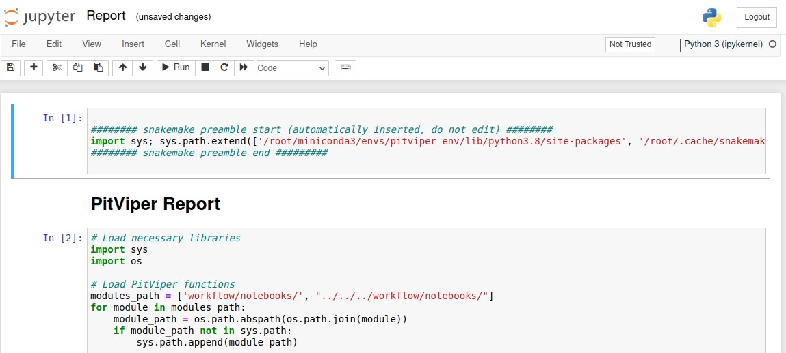
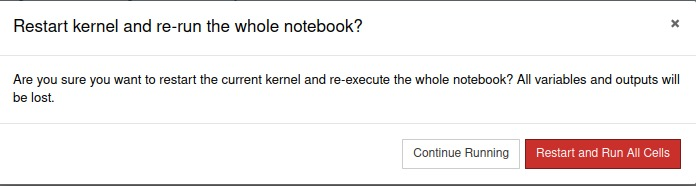
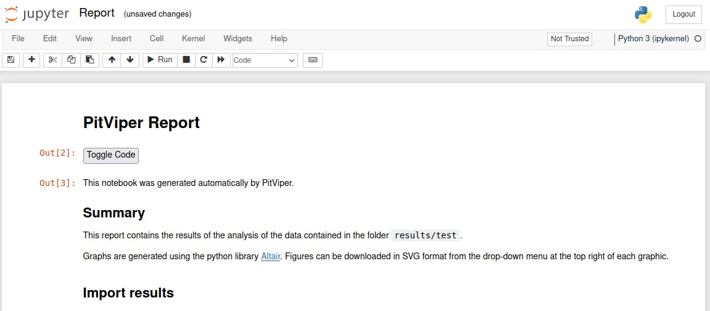

> **A pipeline to analyze functional screening data from shRNA, CRISPR/Cas9 and CRISPR/dCas9 experiments.**

## Introduction

PitViper is a versatile and user-friendly pipeline designed to process, interpret, and visualize functional screening data obtained from various experimental methods such as shRNA, CRISPR/Cas9, and CRISPR/dCas9. This repository hosts the codebase for PitViper, providing researchers with a powerful tool for extracting meaningful insights from their screening experiments.

It stands for "Processing, InTerpretation, and VIsualization of PoolEd screening Results." It is a comprehensive pipeline that streamlines the analysis workflow for functional screening data. The pipeline is built using a combination of powerful tools, including [`Snakemake`](https://snakemake.readthedocs.io/en/stable/) for workflow management, [`Flask`](https://flask.palletsprojects.com/en/2.0.x/) for a lightweight web framework, and [`Jupyter`](https://jupyter.org/) for interactive computational documents.

### Features

- **Modularity**: PitViper supports a wide range of functional screening data, including shRNA, CRISPR/Cas9, and CRISPR/dCas9 experiments.

- **Reproducibility**: Built using Snakemake, PitViper ensures reproducibility and scalability in data analysis.

- **User Interface**: PitViper offers a user-friendly web-based interface powered by Flask, making it accessible to both beginners and experienced researchers.
    
- **Flexibility**: Whether you have raw FASTQ or BAM files, or a pre-processed count matrix, PitViper adapts to your data input preference.

- **Visualization**: Interactive Jupyter Notebook reports facilitate results visualization and interpretation.

## Table of contents

- [Prerequisites](#prerequisites)

- [Installation and execution](#installation-and-execution)

  - [Using the Automated Script](#using-the-automated-script)
 
  - [Jupyter Notebook usage](#jupyter-notebook-usage)
  
  - [Running PitViper from Docker container](#running-pitviper-from-docker-container)

- [Inputs](#inputs)

  - [Starting from raw FASTQ or BAM files](#starting-from-raw-fastq-files)

  - [Starting from count matrix](#starting-from-count-matrix)
 
  - [Example Dataset to test PitViper](#example-dataset-to-test-pitviper)
 
- [PitViper CLI](#pitviper-cli)


## Prerequisites

Before using this script, ensure you have the following prerequisites:

- Conda: Install Conda to manage the application's environment and dependencies. You can download [Conda](https://docs.conda.io/projects/miniconda/en/latest/) from the official Conda website.

- Git: If the application's dependencies include external repositories, Git is required for cloning those repositories. You can download [Git](https://git-scm.com/) from the official Git website.

## Installation and execution

### Using the Automated Script

PitViper can be effortlessly installed using the provided `run.sh` script. This script sets up the Conda environment, installs all necessary dependencies, and launches the PitViper GUI. Dependencies are only installed during the first run.

```bash
# Clone the PitViper repository and navigate to its root directory
git clone https://github.com/PaulArthurM/PitViper.git
```
```bash
# Run the installation script
cd PitViper
./run.sh
```

Available options:

    --mode: Specify the mode for creating the Conda environment (yaml or lock).
    --installer: Specify the Conda package manager to use (conda or mamba).
    --noflask: Optionally skip running the Flask application.

Once installation is complete, the PitViper GUI will automatically open in your default web browser, allowing you to start analyzing your functional screening data seamlessly.



### Jupyter Notebook usage

Once main PitViper analysis will be over, a jupyter notebook server will automatically open in a new browser window.



In the jupyter notebook window click on Report.ipynb file to open it.

Then, click the double arrow button on top (restart the kernel and re-run the whole notebook) to initialize all the widgets.





The notebook is now ready to be used.



If the notebook window does not open, you can open it by copying and pasting the notebook adress displayed in the terminal that will have the following format : localhost:8888/[token]

```bash
# Example lines displayed after PitViper completion in the terminal

 To access the notebook, open this file in a browser:
        file:///root/.local/share/jupyter/runtime/nbserver-3149-open.html
    Or copy and paste one of these URLs:
        http://1320331d8021:8888/?token=c95230fc1989707e31bc8edb5090e0e9dd3e8933f4390d31
     or http://127.0.0.1:8888/?token=c95230fc1989707e31bc8edb5090e0e9dd3e8933f4390d31
```

To re-open a notebook later, activate PitViper conda environment:

```bash
conda activate pitviper_env
```
Then start the notebook server pointing to the results folder:

```bash
jupyter notebook results/
```

### Running PitViper from Docker container

#### Building Image

PitViper main directory contains a Dockerfile that allows easy building of PitViper image. From this folder simply run:

```bash
docker build -t [image_name] .
```

#### Downloading image from dockerhub

PitViper docker image can also be downloaded from dockerhub using:

```bash
docker pull lobrylab/pitviper:v1.0
```

#### Running container

To start a PitViper container simply run:

```bash
docker run -p 5000:5000 -p 8888:8888 -v [fastq/bam_files_path]:[fastq/bam_files_path] --name [name_the_container] [PitViper_image_name]
```

For example:

```bash
docker run -p 5000:5000 -p 8888:8888 -v /home/data/:/home/data/ --name pitviper lobrylab/pitviper:v1.0
```

PitViper GUI can now be accessed in your web browser at the address: localhost:5000.

Upon completion of PitViper analysis, the jupyter notebook will be accessible following the localhost:8888/[token] link displayed in the terminal.

To quit PitViper and stop the container simply quit the jupyter notebook session.

#### Re-starting container

To start a new analysis, just restart the container using the following command :

```bash
docker start -a [container_name]
```

#### Accessing jupyter notebooks of a previous docker PitViper runs

To access the notebook of a previously ran PitViper analysis, first start the container :

```bash
docker start [container_name]
```

Then execute the notebook script: 

```bash
docker exec -ti [container_name] bash /PitViper/notebook.sh
```

The folder containing all previously ran analysis will be accessible in jupyter notebook following the localhost:8888/[token] link displayed in the terminal.

## Inputs

PitViper accommodates diverse input data formats, allowing you to initiate an analysis using raw data files, aligned BAM files, or a count matrix. The specific input requirements vary based on your starting data type.

### Starting from raw FASTQ files

For this approach, you will need the following:

1. Path to FATSQ files on your system.
2. A library file comprising three comma-separated columns without headers: guide ID, guide sequence, target element.
3. A design matrix summarizing your experimental conditions, their replicates, and associated FASTQ files.

#### Design matrix

Suppose you have two conditions, A (control) and B (treatment), each with three replicates. Your design matrix should be structured as follows:

| condition | replicate | fastq                 | order |
|-----------|-----------|-----------------------|-------|
| A         | A_1       | /path/to/A_rep1.fastq | 0     |
| A         | A_2       | /path/to/A_rep2.fastq | 0     |
| A         | A_3       | /path/to/A_rep3.fastq | 0     |
| B         | B_1       | /path/to/B_rep1.fastq | 1     |
| B         | B_2       | /path/to/B_rep2.fastq | 1     |
| B         | B_3       | /path/to/B_rep3.fastq | 1     |

In the order column, the control condition (A) is designated by order = 0, and any condition with an order value greater than 0 (e.g., 1 for B) is treated as a treatment condition. The order should remain consistent across replicates.

#### Library file

The library file should be comma-separated with three columns: guide's ID, guide's sequence, and the corresponding target element.

```
guide_A.1,CTTAGTTTTGAACAAGTACA,element_A
guide_A.2,GTTGAGTTATCACACATCAT,element_A
guide_A.3,AATGTAGTGTAGCTACAGTG,element_A
guide_B.1,TTAGTTTATATCTTATGGCA,element_B
guide_B.2,GATTGTCTGTGAAATTTCTG,element_B
```

### Starting from aligned BAM files

#### Design matrix

If you have aligned BAM files instead of raw FASTQ files, follow these modifications to the design matrix:

- Replace the fastq column with a bam column, and replace the paths to FASTQ files with paths to BAM files.

| condition | replicate | bam                 | order |
|-----------|-----------|---------------------|-------|
| A         | A_1       | /path/to/A_rep1.bam | 0     |
| A         | A_2       | /path/to/A_rep2.bam | 0     |
| A         | A_3       | /path/to/A_rep3.bam | 0     |
| B         | B_1       | /path/to/B_rep1.bam | 1     |
| B         | B_2       | /path/to/B_rep2.bam | 1     |
| B         | B_3       | /path/to/B_rep3.bam | 1     |


### Starting from count matrix

Starting from a count matrix eliminates the need for a fastq or bam column:

| condition | replicate | order |
|-----------|-----------|-------|
| A         | A_1       | 0     |
| A         | A_2       | 0     |
| A         | A_3       | 0     |
| B         | B_1       | 1     |
| B         | B_2       | 1     |
| B         | B_3       | 1     |

However, the replicate column must contain the same labels as those in the count matrix header:

| shRNA       | Gene      | A_1 | A_2 | A_3 | B_1 | B_2 | B_3 |
|-------------|-----------|-----|-----|-----|-----|-----|-----|
| guide_A.1   | element_A | 456 | 273 | 345 | 354 | 587 | 258 |
| guide_A.2   | element_A | 354 | 234 | 852 | 546 | 64  | 452 |


### Example Dataset to test PitViper

Test dataset consisting of:

- a count matrix: test_counts.tsv

- a design file: design.tsv

- a list of control features: negative_controls.txt

    
can be found in [PitViper/resources/example](https://github.com/lobrylab/PitViper/tree/master/PitViper/resources/example/) folder.

These files can be used to test proper PitViper functionning.


## PitViper CLI

PitViper CLI is a command-line tool for running the PitViper pipeline.

### Usage

`$ pitviper.py --configfile <configfile> [--dry_run] [--jobs <jobs>] [--notebook <notebook>]`

    --configfile: Path to the configuration file. The configuration file must be in YAML format.
    --dry_run: If enabled, the pipeline will be run in dry run mode, which means that no commands will be executed. This is useful for testing the pipeline without actually running it.
    --jobs: Number of Snakemake rules to run in parallel. The default is 1.
    --notebook: Output file(s) of a PitViper rule with "notebook" entry.

### Examples

```bash
python pitviper.py --configfile config.yaml
```
```bash
# Run the pipeline in dry run mode
python pitviper.py --configfile config.yaml --dry_run
```
```bash
# Run the pipeline with 4 jobs in parallel
python pitviper.py --configfile config.yaml --jobs 4
```
```bash
# Run the pipeline and save the output notebook to notebook.html
python pitviper.py --configfile config.yaml --notebook notebook.html
```
